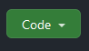

# 🛒 MA LISTE DE COURSES : GROCERY LIST 🛒

API REST affichant une liste d'articles pour préparer sa liste de courses.

Ce projet me permet de pratiquer diverses notions apprises en cours (code et organisation d'un projet). Il est en cours de développement.

Il a aussi pour vocation d'être accessible à d'autres personnes qui veulent découvrir les API avec Node.js et express : des commentaires aident à comprendre ce qui est mis en place

***
<details>
<summary>Table des matières</summary>

- [🛒 MA LISTE DE COURSES : GROCERY LIST 🛒](#-ma-liste-de-courses--grocery-list-)
  - [Stack technique (pré-requis)](#stack-technique-pré-requis)
  - [Installation](#installation)
  - [Fonctionnalités](#fonctionnalités)
    - [en place](#en-place)
    - [à venir](#à-venir)
  - [Précisions](#précisions)
    - [Catégories perso](#catégories-perso)
    - [Rayon (du magasin)](#rayon-du-magasin)
    - [Marques](#marques)
    - [Seeding](#seeding)
  
</details>

***

## Stack technique (pré-requis)

Pour pouvoir installer l'API vous devez au préalable avoir cette stack installée en global sur votre machine :

- [NodeJS](https://nodejs.org/en/download/) (voir la version exacte dans [`.nvmrc`](.nvmrc), actuellement Node 22)
- [PostgreSQL](https://www.postgresql.org/download/) (v12 ou supérieure)
- [Git](https://git-scm.com/downloads)

## Installation
<details>
<summary>comment installer l'app localement ?</summary>

Vous pouvez cloner le repo en cliquant sur le bouton "code" en haut à droite de la page d'accueil du repo et choisir la méthode que vous préférez (HTTPS, SSH ou GithubCLI).

 

Sur votre terminal exécutez la commande suivante :

```bash
git clone <url du dépôt>
```

Dans le dossier local, installez les dépendances NPM

```bash
npm install
```

### Variables d'environnement

Le chargement des variables d'environnement se fait avec [dotenvx](https://dotenvx.com/), un fichier différent par environnement :

- `.env.development` pour `npm run dev` et `npm test`
- `.env.production` pour `npm run start`

Chaque fichier suit le format de [`.env.example`](.env.example) (`DATABASE_URL`, `DATABASE_TEST_URL`, `PORT`, `BASE_URL`, `CORS_ORIGIN`). `DATABASE_TEST_URL` doit pointer vers une base de test dédiée (les tests suppriment/recréent des données dedans, ne la faites jamais pointer sur votre base de dev ou de prod). `CORS_ORIGIN` doit être l'origine exacte de votre frontend (ex: `http://localhost:3000`) ; sans cette variable, l'API refuse toutes les requêtes cross-origin par défaut (choix volontaire pour éviter d'ouvrir le CORS en grand par erreur).

```bash
cp .env.example .env.development
cp .env.example .env.production
# puis éditez les valeurs (identifiants de connexion, ports, etc.)
```

### Base de données

Créez une base PostgreSQL pour le développement et une pour les tests, puis appliquez les migrations avec le script npm dédié (il rejoue dans l'ordre les fichiers SQL de [`migrations/deploy`](migrations/deploy)) :

```bash
createdb <nom de votre base de dev>
createdb <nom de votre base de test>
npm run migrate        # applique les migrations sur DATABASE_URL (.env.development)
npm run migrate:test   # applique les migrations sur DATABASE_TEST_URL (.env.development)
npm run migrate:prod   # applique les migrations sur DATABASE_URL (.env.production)
```

### Lancer le serveur

```bash
npm run start   # avec .env.production
npm run dev     # avec .env.development, rechargement automatique à chaque changement de fichier
```

Vous pouvez accéder aux données avec le fichier `api.http` qui se trouve à la racine du projet.

### Lancer les tests

```bash
npm test
```

Utilise `DATABASE_TEST_URL` défini dans `.env.development`.
</details>


## Fonctionnalités

💡 La documentation d'API est disponible sur '/api-docs' (une fois le serveur lancé bien sûr ;) 

### en place


Accès en local (voir [installation](#installation)).

- Articles (item) :
   - accéder à la liste des articles
   - filtrer la liste des articles en fonction de la marque, le rayon ou la Catégorie perso
   - accéder à un article en particulier
   - créer un article
- Catégories (category) :
   - accéder à la liste des catégories
   - accéder à une catégorie en particulier
   - créer une catégorie
- Rayons (shelf) :
   - accéder à la liste des rayons
   - accéder à une rayon en particulier
   - créer une rayon
- marques (brand) :
   - accéder à la liste des marques
   - accéder à une marque en particulier
   - créer une marque
- Documentation

### à venir

- Modification d'articles, catégories, marques et rayons,
- Suppression d'articles, catégories, marques et rayons.

## Précisions
### Catégories perso

Une catégorie représente la façon dont un utilisateur classe un article (dans sa tête ou dans son cellier), ne correspond pas forcément aux rayons du magasin.
Donnée facultative.

### Rayon (du magasin)

Un rayon représente le rayon du magasin où on peut trouver cet article.
Donnée facultative.
### Marques

La marque permet de préciser la marque voulue pour un article.
Donnée facultative.

### Seeding

Un fichier de seed avec quelques données (rien de bien équilibré... 😅) est dispo dans le [dossier data](https://github.com/VirginieLemaire/My-grocery-list/tree/main/data).